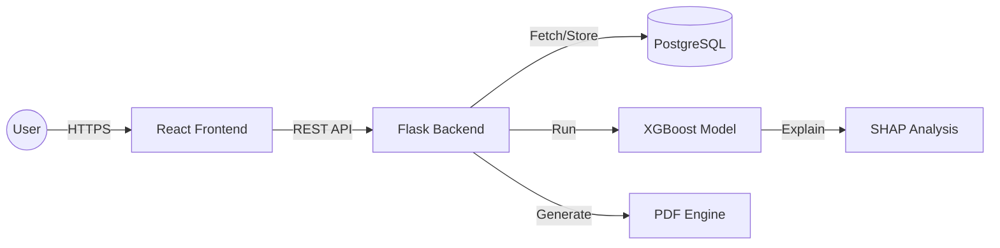

# 🏦 Credit Risk Assessment System


An end-to-end **AI-powered Credit Risk Assessment** platform designed to predict loan default probabilities with high precision. This system combines an **XGBoost machine learning engine** with a premium, real-time analytics dashboard to empower credit analysts and risk managers.

---

## 🚀 Key Features

- **🧠 Advanced ML Engine**: Utilizes a tuned **XGBoost Classifier** for high-accuracy default prediction.
- **🔍 Explainable AI (SHAP)**: Provides detailed feature contribution analysis for every prediction, showing exactly *why* a loan was flagged as risky.
- **📊 Interactive Executive Dashboard**: Real-time visualization of approval trends, risk distribution, and key performance indicators (KPIs).
- **📋 Audit & History**: Full audit log of all historical predictions with detailed breakdowns of applicant features.
- **📄 Professional PDF Reports**: One-click generation of comprehensive risk assessment reports for documentation and compliance.
- **🔐 Secure Access**: Role-based access control (Analyst, Risk Manager, Admin) with **JWT-secured** authentication.
- **📱 Responsive Premium UI**: A modern, glassmorphic dark-themed interface built with React and Tailwind CSS.

---

## 🛠️ Technology Stack

### **Backend**
- **Language**: Python 3.9+
- **Framework**: Flask
- **Authentication**: Flask-JWT-Extended
- **Database**: PostgreSQL (with `psycopg2` adapter)
- **ML Libraries**: Scikit-learn, XGBoost, Pandas, SHAP
- **PDF Generation**: ReportLab

### **Frontend**
- **Library**: React 18
- **Build Tool**: Vite
- **Styling**: Tailwind CSS
- **Charts**: Recharts
- **Icons**: Lucide-React / Emoji-standardized icons

---

## ⚙️ Installation & Setup

### **1. Prerequisites**
- Python 3.9+
- Node.js 18+
- PostgreSQL Instance

### **2. Database Setup**
Create a PostgreSQL database named `credit_risk_db` and initialize the schema:
```sql
CREATE TABLE users (
    id SERIAL PRIMARY KEY,
    name VARCHAR(100),
    email VARCHAR(100) UNIQUE,
    password BYTEA,
    role VARCHAR(20),
    created_at TIMESTAMP DEFAULT CURRENT_TIMESTAMP
);

CREATE TABLE predictions (
    id SERIAL PRIMARY KEY,
    loan_id VARCHAR(50),
    age INT,
    income FLOAT,
    loanamount FLOAT,
    creditscore INT,
    monthsemployed INT,
    numcreditlines INT,
    interestrate FLOAT,
    loanterm INT,
    dtiratio FLOAT,
    education VARCHAR(50),
    employmenttype VARCHAR(50),
    maritalstatus VARCHAR(50),
    hasmortgage INT,
    hasdependents INT,
    loanpurpose VARCHAR(50),
    hascosigner INT,
    prediction INT,
    probability FLOAT,
    shap_values JSONB,
    created_at TIMESTAMP DEFAULT CURRENT_TIMESTAMP
);
```

### **3. Backend Installation**
1.  Navigate to the root directory.
2.  Create and activate a virtual environment:
    ```bash
    python -m venv venv
    ./venv/Scripts/activate  # Windows
    source venv/bin/activate # Linux/Mac
    ```
3.  Install dependencies:
    ```bash
    pip install -r requirements.txt
    ```
4.  Configure `.env` file:
    ```env
    DB_HOST=localhost
    DB_NAME=credit_risk_db
    DB_USER=postgres
    DB_PASS=your_password
    DB_PORT=5432
    JWT_SECRET=your_secret_key
    ```
5.  Start the Flask server:
    ```bash
    python main.py
    ```

### **4. Frontend Installation**
1.  Navigate to `credit-risk-ui/`.
2.  Install dependencies:
    ```bash
    npm install
    ```
3.  Configure `.env` file:
    ```env
    VITE_API_BASE_URL=http://127.0.0.1:5000
    ```
4.  Launch the development environment:
    ```bash
    npm run dev
    ```

---

## 🧩 Architecture Overview



---

## 📈 Model Performance

The current model is evaluated using a significant dataset with the following results:
- **Accuracy**: ~64%
- **Recall (Sensitivity)**: ~76% (Optimized to detect actual defaulters)
- **ROC-AUC**: ~76%
- **Explainability**: SHAP (SHapley Additive exPlanations) is used to interpret tree-based models, ensuring transparency in financial decision-making.

---

## 🤝 Contributing

Contributions are welcome! Please feel free to submit a Pull Request.

1. Fork the Project
2. Create your Feature Branch (`git checkout -b feature/AmazingFeature`)
3. Commit your Changes (`git commit -m 'Add some AmazingFeature'`)
4. Push to the Branch (`git push origin feature/AmazingFeature`)
5. Open a Pull Request

---

## 📄 License

Distributed under the **MIT License**. See `LICENSE` for more information.

---

*Developed by [@Soham](https://github.com/sohamnp06)*
